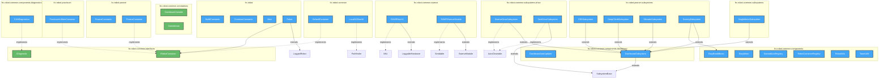

# Code Structure Flowchart

```mermaid
flowchart TD
    subgraph frc_robot[frc.robot]
        BuildConstants[BuildConstants]
        CommonConstants[CommonConstants]
        Main[Main]
        Robot[Robot]
    end
    subgraph frc_robot_common_annotations[frc.robot.common.annotations]
        DashboardVariable[DashboardVariable]
        NamedAuto[NamedAuto]
        Robot[Robot]
    end
    subgraph frc_robot_common_components_dashboard[frc.robot.common.components.dashboard]
        DashboardAutoUpdater[DashboardAutoUpdater]
        DashboardSubsystem[DashboardSubsystem]
    end
    subgraph frc_robot_common_components_diagnostics[frc.robot.common.components.diagnostics]
        CANDiagnostics[CANDiagnostics]
    end
    subgraph frc_robot_common_components[frc.robot.common.components]
        EasyBreakBeam[EasyBreakBeam]
        EasyMotor[EasyMotor]
        NamedAutoRegistry[NamedAutoRegistry]
        RobotContainerRegistry[RobotContainerRegistry]
        RobotUtils[RobotUtils]
        TeamUtils[TeamUtils]
    end
    subgraph frc_robot_common[frc.robot.common]
        DefaultContainer[DefaultContainer]
        LocalADStarAK[LocalADStarAK]
    end
    subgraph frc_robot_common_interfaces[frc.robot.common.interfaces]
        IDiagnostic[IDiagnostic]
        IRobotContainer[IRobotContainer]
    end
    subgraph frc_robot_common_subsystems_drive[frc.robot.common.subsystems.drive]
        SwerveDriveSubsystem[SwerveDriveSubsystem]
        TankDriveSubsystem[TankDriveSubsystem]
    end
    subgraph frc_robot_common_subsystems[frc.robot.common.subsystems]
        SingleMotorSubsystem[SingleMotorSubsystem]
    end
    subgraph frc_robot_common_swerve[frc.robot.common.swerve]
        RAWRNavX2[RAWRNavX2]
        RAWRSwerveModule[RAWRSwerveModule]
    end
    subgraph frc_robot_pearce[frc.robot.pearce]
        PearceConstants[PearceConstants]
        PearceContainer[PearceContainer]
    end
    subgraph frc_robot_pearce_subsystems[frc.robot.pearce.subsystems]
        CBSSubsystem[CBSSubsystem]
        DeepClimbSubsystem[DeepClimbSubsystem]
        ElevatorSubsystem[ElevatorSubsystem]
        ScoringSubsystem[ScoringSubsystem]
    end
    subgraph frc_robot_practicum[frc.robot.practicum]
        PracticumInStemContainer[PracticumInStemContainer]
    end
    DashboardSubsystem -->|extends| SubsystemBase
    SwerveDriveSubsystem -->|extends| DashboardSubsystem
    TankDriveSubsystem -->|extends| SubsystemBase
    SingleMotorSubsystem -->|extends| DashboardSubsystem
    RAWRNavX2 -->|extends| LoggableHardware
    RAWRSwerveModule -->|extends| SwerveModule
    CBSSubsystem -->|extends| DashboardSubsystem
    DeepClimbSubsystem -->|extends| DashboardSubsystem
    ElevatorSubsystem -->|extends| DashboardSubsystem
    ScoringSubsystem -->|extends| DashboardSubsystem
    Robot -->|extends| LoggedRobot
    CANDiagnostics -.implements.-> IDiagnostic
    DefaultContainer -.implements.-> IRobotContainer
    LocalADStarAK -.implements.-> Pathfinder
    SwerveDriveSubsystem -.implements.-> AutoCloseable
    TankDriveSubsystem -.implements.-> AutoCloseable
    RAWRNavX2 -.implements.-> IMU
    RAWRSwerveModule -.implements.-> Sendable
    PearceContainer -.implements.-> IRobotContainer
    PracticumInStemContainer -.implements.-> IRobotContainer
    ScoringSubsystem --> EasyBreakBeam
    Robot --> IRobotContainer
    style BuildConstants fill:#42a5f5,stroke:#333,stroke-width:2px,color:#fff
    style DashboardVariable fill:#66bb6a,stroke:#333,stroke-width:2px,color:#fff
    style NamedAuto fill:#66bb6a,stroke:#333,stroke-width:2px,color:#fff
    style Robot fill:#66bb6a,stroke:#333,stroke-width:2px,color:#fff
    style DashboardAutoUpdater fill:#42a5f5,stroke:#333,stroke-width:2px,color:#fff
    style DashboardSubsystem fill:#42a5f5,stroke:#333,stroke-width:2px,color:#fff
    style CANDiagnostics fill:#42a5f5,stroke:#333,stroke-width:2px,color:#fff
    style EasyBreakBeam fill:#42a5f5,stroke:#333,stroke-width:2px,color:#fff
    style EasyMotor fill:#42a5f5,stroke:#333,stroke-width:2px,color:#fff
    style NamedAutoRegistry fill:#42a5f5,stroke:#333,stroke-width:2px,color:#fff
    style RobotContainerRegistry fill:#42a5f5,stroke:#333,stroke-width:2px,color:#fff
    style RobotUtils fill:#42a5f5,stroke:#333,stroke-width:2px,color:#fff
    style TeamUtils fill:#42a5f5,stroke:#333,stroke-width:2px,color:#fff
    style DefaultContainer fill:#42a5f5,stroke:#333,stroke-width:2px,color:#fff
    style IDiagnostic fill:#66bb6a,stroke:#333,stroke-width:2px,color:#fff
    style IRobotContainer fill:#66bb6a,stroke:#333,stroke-width:2px,color:#fff
    style LocalADStarAK fill:#42a5f5,stroke:#333,stroke-width:2px,color:#fff
    style SwerveDriveSubsystem fill:#42a5f5,stroke:#333,stroke-width:2px,color:#fff
    style TankDriveSubsystem fill:#42a5f5,stroke:#333,stroke-width:2px,color:#fff
    style SingleMotorSubsystem fill:#42a5f5,stroke:#333,stroke-width:2px,color:#fff
    style RAWRNavX2 fill:#42a5f5,stroke:#333,stroke-width:2px,color:#fff
    style RAWRSwerveModule fill:#42a5f5,stroke:#333,stroke-width:2px,color:#fff
    style CommonConstants fill:#42a5f5,stroke:#333,stroke-width:2px,color:#fff
    style Main fill:#42a5f5,stroke:#333,stroke-width:2px,color:#fff
    style PearceConstants fill:#42a5f5,stroke:#333,stroke-width:2px,color:#fff
    style PearceContainer fill:#42a5f5,stroke:#333,stroke-width:2px,color:#fff
    style CBSSubsystem fill:#42a5f5,stroke:#333,stroke-width:2px,color:#fff
    style DeepClimbSubsystem fill:#42a5f5,stroke:#333,stroke-width:2px,color:#fff
    style ElevatorSubsystem fill:#42a5f5,stroke:#333,stroke-width:2px,color:#fff
    style ScoringSubsystem fill:#42a5f5,stroke:#333,stroke-width:2px,color:#fff
    style PracticumInStemContainer fill:#42a5f5,stroke:#333,stroke-width:2px,color:#fff
    style Robot fill:#42a5f5,stroke:#333,stroke-width:2px,color:#fff
```
