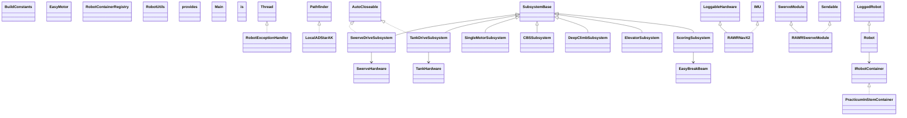

# Code Structure Diagram

```mermaid
classDiagram
    class BuildConstants
    class Robot
    class EasyBreakBeam
    class EasyMotor
    class SwerveHardware
    class TankHardware
    class RobotContainerRegistry
    class RobotExceptionHandler
    class RobotUtils
    class IRobotContainer
    class LocalADStarAK
    class SwerveDriveSubsystem
    class TankDriveSubsystem
    class SingleMotorSubsystem
    class RAWRNavX2
    class RAWRSwerveModule
    class provides
    class Main
    class is
    class CBSSubsystem
    class DeepClimbSubsystem
    class ElevatorSubsystem
    class ScoringSubsystem
    class PracticumInStemContainer
    class Robot
    SubsystemBase <|-- SwerveDriveSubsystem
    SubsystemBase <|-- TankDriveSubsystem
    SubsystemBase <|-- SingleMotorSubsystem
    LoggableHardware <|-- RAWRNavX2
    SwerveModule <|-- RAWRSwerveModule
    SubsystemBase <|-- CBSSubsystem
    SubsystemBase <|-- DeepClimbSubsystem
    SubsystemBase <|-- ElevatorSubsystem
    SubsystemBase <|-- ScoringSubsystem
    LoggedRobot <|-- Robot
    Thread <|.. RobotExceptionHandler
    Pathfinder <|.. LocalADStarAK
    AutoCloseable <|.. SwerveDriveSubsystem
    AutoCloseable <|.. TankDriveSubsystem
    IMU <|.. RAWRNavX2
    Sendable <|.. RAWRSwerveModule
    IRobotContainer <|.. PracticumInStemContainer
    SwerveDriveSubsystem --> SwerveHardware
    TankDriveSubsystem --> TankHardware
    ScoringSubsystem --> EasyBreakBeam
    Robot --> IRobotContainer
```
