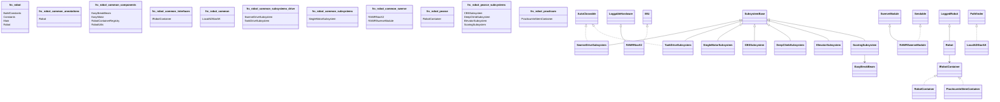

# Code Structure Diagram

```mermaid
classDiagram
    class frc_robot {
        BuildConstants
        Constants
        Main
        Robot
    }
    class frc_robot_common_annotations {
        Robot
    }
    class frc_robot_common_components {
        EasyBreakBeam
        EasyMotor
        RobotContainerRegistry
        RobotUtils
    }
    class frc_robot_common_interfaces {
        IRobotContainer
    }
    class frc_robot_common {
        LocalADStarAK
    }
    class frc_robot_common_subsystems_drive {
        SwerveDriveSubsystem
        TankDriveSubsystem
    }
    class frc_robot_common_subsystems {
        SingleMotorSubsystem
    }
    class frc_robot_common_swerve {
        RAWRNavX2
        RAWRSwerveModule
    }
    class frc_robot_pearce {
        RobotContainer
    }
    class frc_robot_pearce_subsystems {
        CBSSubsystem
        DeepClimbSubsystem
        ElevatorSubsystem
        ScoringSubsystem
    }
    class frc_robot_practicum {
        PracticumInStemContainer
    }
    SubsystemBase <|-- SwerveDriveSubsystem
    SubsystemBase <|-- TankDriveSubsystem
    SubsystemBase <|-- SingleMotorSubsystem
    LoggableHardware <|-- RAWRNavX2
    SwerveModule <|-- RAWRSwerveModule
    SubsystemBase <|-- CBSSubsystem
    SubsystemBase <|-- DeepClimbSubsystem
    SubsystemBase <|-- ElevatorSubsystem
    SubsystemBase <|-- ScoringSubsystem
    LoggedRobot <|-- Robot
    Pathfinder <|.. LocalADStarAK
    AutoCloseable <|.. SwerveDriveSubsystem
    AutoCloseable <|.. TankDriveSubsystem
    IMU <|.. RAWRNavX2
    Sendable <|.. RAWRSwerveModule
    IRobotContainer <|.. RobotContainer
    IRobotContainer <|.. PracticumInStemContainer
    ScoringSubsystem --> EasyBreakBeam
    Robot --> IRobotContainer
```
