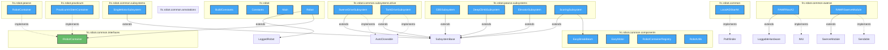

# Code Structure Flowchart

```mermaid
flowchart TD
    subgraph frc_robot[frc.robot]
        BuildConstants[BuildConstants]
        Constants[Constants]
        Main[Main]
        Robot[Robot]
    end
    subgraph frc_robot_common_annotations[frc.robot.common.annotations]
        Robot[Robot]
    end
    subgraph frc_robot_common_components[frc.robot.common.components]
        EasyBreakBeam[EasyBreakBeam]
        EasyMotor[EasyMotor]
        RobotContainerRegistry[RobotContainerRegistry]
        RobotUtils[RobotUtils]
    end
    subgraph frc_robot_common_interfaces[frc.robot.common.interfaces]
        IRobotContainer[IRobotContainer]
    end
    subgraph frc_robot_common[frc.robot.common]
        LocalADStarAK[LocalADStarAK]
    end
    subgraph frc_robot_common_subsystems_drive[frc.robot.common.subsystems.drive]
        SwerveDriveSubsystem[SwerveDriveSubsystem]
        TankDriveSubsystem[TankDriveSubsystem]
    end
    subgraph frc_robot_common_subsystems[frc.robot.common.subsystems]
        SingleMotorSubsystem[SingleMotorSubsystem]
    end
    subgraph frc_robot_common_swerve[frc.robot.common.swerve]
        RAWRNavX2[RAWRNavX2]
        RAWRSwerveModule[RAWRSwerveModule]
    end
    subgraph frc_robot_pearce[frc.robot.pearce]
        RobotContainer[RobotContainer]
    end
    subgraph frc_robot_pearce_subsystems[frc.robot.pearce.subsystems]
        CBSSubsystem[CBSSubsystem]
        DeepClimbSubsystem[DeepClimbSubsystem]
        ElevatorSubsystem[ElevatorSubsystem]
        ScoringSubsystem[ScoringSubsystem]
    end
    subgraph frc_robot_practicum[frc.robot.practicum]
        PracticumInStemContainer[PracticumInStemContainer]
    end
    SwerveDriveSubsystem -->|extends| SubsystemBase
    TankDriveSubsystem -->|extends| SubsystemBase
    SingleMotorSubsystem -->|extends| SubsystemBase
    RAWRNavX2 -->|extends| LoggableHardware
    RAWRSwerveModule -->|extends| SwerveModule
    CBSSubsystem -->|extends| SubsystemBase
    DeepClimbSubsystem -->|extends| SubsystemBase
    ElevatorSubsystem -->|extends| SubsystemBase
    ScoringSubsystem -->|extends| SubsystemBase
    Robot -->|extends| LoggedRobot
    LocalADStarAK -.implements.-> Pathfinder
    SwerveDriveSubsystem -.implements.-> AutoCloseable
    TankDriveSubsystem -.implements.-> AutoCloseable
    RAWRNavX2 -.implements.-> IMU
    RAWRSwerveModule -.implements.-> Sendable
    RobotContainer -.implements.-> IRobotContainer
    PracticumInStemContainer -.implements.-> IRobotContainer
    ScoringSubsystem --> EasyBreakBeam
    Robot --> IRobotContainer
    style BuildConstants fill:#42a5f5,stroke:#333,stroke-width:2px,color:#fff
    style Robot fill:#66bb6a,stroke:#333,stroke-width:2px,color:#fff
    style EasyBreakBeam fill:#42a5f5,stroke:#333,stroke-width:2px,color:#fff
    style EasyMotor fill:#42a5f5,stroke:#333,stroke-width:2px,color:#fff
    style RobotContainerRegistry fill:#42a5f5,stroke:#333,stroke-width:2px,color:#fff
    style RobotUtils fill:#42a5f5,stroke:#333,stroke-width:2px,color:#fff
    style IRobotContainer fill:#66bb6a,stroke:#333,stroke-width:2px,color:#fff
    style LocalADStarAK fill:#42a5f5,stroke:#333,stroke-width:2px,color:#fff
    style SwerveDriveSubsystem fill:#42a5f5,stroke:#333,stroke-width:2px,color:#fff
    style TankDriveSubsystem fill:#42a5f5,stroke:#333,stroke-width:2px,color:#fff
    style SingleMotorSubsystem fill:#42a5f5,stroke:#333,stroke-width:2px,color:#fff
    style RAWRNavX2 fill:#42a5f5,stroke:#333,stroke-width:2px,color:#fff
    style RAWRSwerveModule fill:#42a5f5,stroke:#333,stroke-width:2px,color:#fff
    style Constants fill:#42a5f5,stroke:#333,stroke-width:2px,color:#fff
    style Main fill:#42a5f5,stroke:#333,stroke-width:2px,color:#fff
    style RobotContainer fill:#42a5f5,stroke:#333,stroke-width:2px,color:#fff
    style CBSSubsystem fill:#42a5f5,stroke:#333,stroke-width:2px,color:#fff
    style DeepClimbSubsystem fill:#42a5f5,stroke:#333,stroke-width:2px,color:#fff
    style ElevatorSubsystem fill:#42a5f5,stroke:#333,stroke-width:2px,color:#fff
    style ScoringSubsystem fill:#42a5f5,stroke:#333,stroke-width:2px,color:#fff
    style PracticumInStemContainer fill:#42a5f5,stroke:#333,stroke-width:2px,color:#fff
    style Robot fill:#42a5f5,stroke:#333,stroke-width:2px,color:#fff
```
