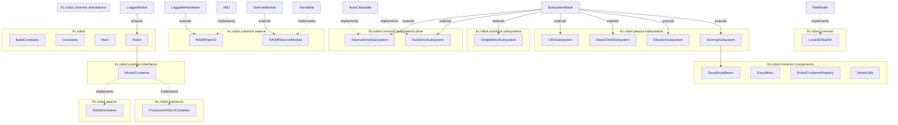

# Code Structure Flowchart

```mermaid
flowchart TD
    subgraph frc_robot[frc.robot]
        BuildConstants[BuildConstants]
        Constants[Constants]
        Main[Main]
        Robot[Robot]
    end
    subgraph frc_robot_common_annotations[frc.robot.common.annotations]
        Robot[Robot]
    end
    subgraph frc_robot_common_components[frc.robot.common.components]
        EasyBreakBeam[EasyBreakBeam]
        EasyMotor[EasyMotor]
        RobotContainerRegistry[RobotContainerRegistry]
        RobotUtils[RobotUtils]
    end
    subgraph frc_robot_common_interfaces[frc.robot.common.interfaces]
        IRobotContainer[IRobotContainer]
    end
    subgraph frc_robot_common[frc.robot.common]
        LocalADStarAK[LocalADStarAK]
    end
    subgraph frc_robot_common_subsystems_drive[frc.robot.common.subsystems.drive]
        SwerveDriveSubsystem[SwerveDriveSubsystem]
        TankDriveSubsystem[TankDriveSubsystem]
    end
    subgraph frc_robot_common_subsystems[frc.robot.common.subsystems]
        SingleMotorSubsystem[SingleMotorSubsystem]
    end
    subgraph frc_robot_common_swerve[frc.robot.common.swerve]
        RAWRNavX2[RAWRNavX2]
        RAWRSwerveModule[RAWRSwerveModule]
    end
    subgraph frc_robot_pearce[frc.robot.pearce]
        RobotContainer[RobotContainer]
    end
    subgraph frc_robot_pearce_subsystems[frc.robot.pearce.subsystems]
        CBSSubsystem[CBSSubsystem]
        DeepClimbSubsystem[DeepClimbSubsystem]
        ElevatorSubsystem[ElevatorSubsystem]
        ScoringSubsystem[ScoringSubsystem]
    end
    subgraph frc_robot_practicum[frc.robot.practicum]
        PracticumInStemContainer[PracticumInStemContainer]
    end
    SubsystemBase -->|extends| SwerveDriveSubsystem
    SubsystemBase -->|extends| TankDriveSubsystem
    SubsystemBase -->|extends| SingleMotorSubsystem
    LoggableHardware -->|extends| RAWRNavX2
    SwerveModule -->|extends| RAWRSwerveModule
    SubsystemBase -->|extends| CBSSubsystem
    SubsystemBase -->|extends| DeepClimbSubsystem
    SubsystemBase -->|extends| ElevatorSubsystem
    SubsystemBase -->|extends| ScoringSubsystem
    LoggedRobot -->|extends| Robot
    Pathfinder -.implements.-> LocalADStarAK
    AutoCloseable -.implements.-> SwerveDriveSubsystem
    AutoCloseable -.implements.-> TankDriveSubsystem
    IMU -.implements.-> RAWRNavX2
    Sendable -.implements.-> RAWRSwerveModule
    IRobotContainer -.implements.-> RobotContainer
    IRobotContainer -.implements.-> PracticumInStemContainer
    ScoringSubsystem --> EasyBreakBeam
    Robot --> IRobotContainer
```
